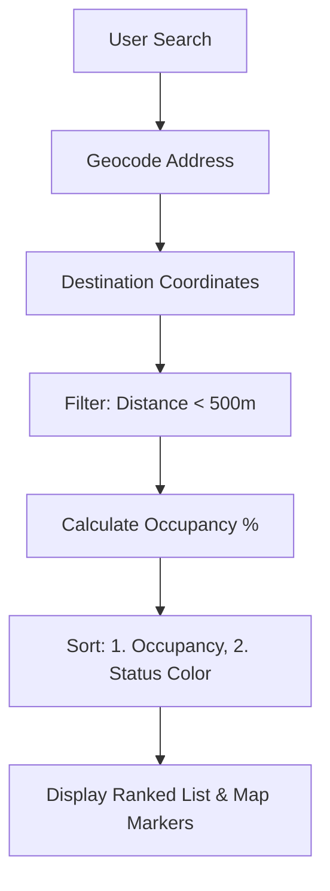

# Parking Logic Breakdown

This document explains the technical implementation of how Parkie finds and ranks "closest" parking lots when a user searches for a destination.

## 1. Data Source & Realtime Updates
The application maintains a global state of parking lots in [HomeScreen.js](file:///c:/Users/Lenovo/unihackers/Frontend/Parkie/screens/HomeScreen.js).
- **Initial Load**: Data is fetched from the backend via `apiService.fetchAllLots()`.
- **Realtime Sync**: The app uses **Supabase Realtime** to listen for `INSERT`, `UPDATE`, and `DELETE` events on the `parking_lots` table. This ensures that occupancy numbers (free vs. occupied spots) are updated instantly without refreshing.

## 2. Searching for a Location
The search flow starts in the [NearbySearch.js](file:///c:/Users/Lenovo/unihackers/Frontend/Parkie/components/NearbySearch.js) component:
- **Autocomplete**: Uses OpenStreetMap's Nominatim API. It biases search results towards labels near the user's current GPS position (using a 0.5-degree viewbox).
- **Geocoding**: Once a location is selected or "Go" is pressed, the app resolves the name into **Latitude/Longitude** coordinates using `expo-location`.

## 3. The "Closest" Ranking Algorithm
The core logic resides in the [rankLots](file:///c:/Users/Lenovo/unihackers/Frontend/Parkie/components/NearbySearch.js#39-58) function. Contrary to simple distance-based sorting, Parkie prioritizes **availability**.

### Step A: Distance Filtering
The app calculates the distance between the searched destination and every parking lot using the **Haversine Formula** (distance on a sphere). 
> [!NOTE]
> Only lots within a **500-meter radius** of the destination are considered "nearby".

### Step B: Multi-Factor Ranking
The filtered lots are sorted based on these criteria:

1.  **Occupancy Percentage (Primary)**:
    Lots with the most free space (lowest `occupied / capacity` ratio) appear first.
2.  **Status Priority (Secondary)**:
    If two lots have similar occupancy, they are ranked by their status color:
    - 🟢 **Green**: High availability
    - 🟡 **Yellow**: Medium availability
    - 🔴 **Red**: Critically low availability
    - ⚪ **Gray**: Unknown/Closed

## 4. Map Visualization
Once ranked, the results are passed back to [HomeScreen.js](file:///c:/Users/Lenovo/unihackers/Frontend/Parkie/screens/HomeScreen.js) and [GoogleMaps.js](file:///c:/Users/Lenovo/unihackers/Frontend/Parkie/components/GoogleMaps.js):
- The map automatically centers and zooms (`fitToCoordinates`) to show the destination, the user's current location, and the identified parking lots.
- Indicators on the map pins show exactly how many spots are "free" in realtime.

